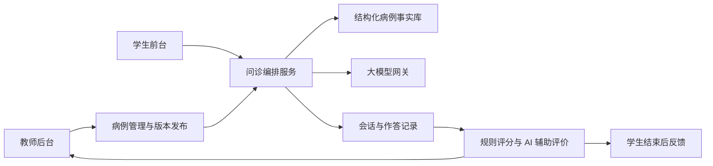
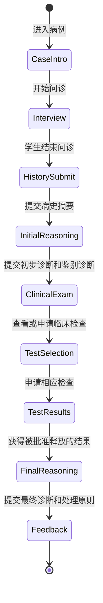
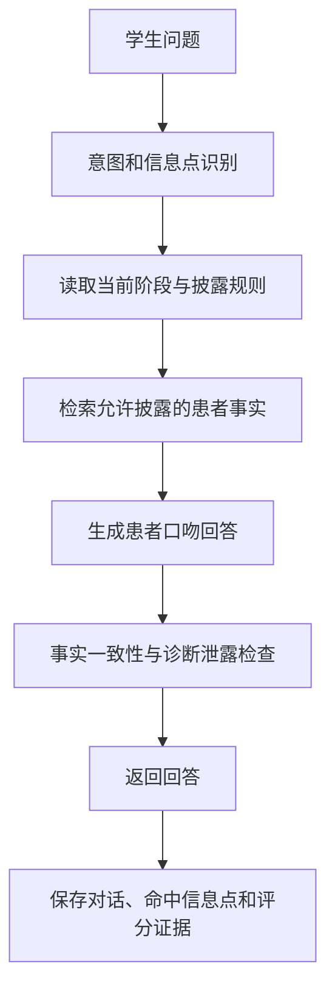

# 口腔门诊 AI 模拟问诊系统产品设计文档

> 文档用途：交付开发团队或 Linux 环境中的 Codex，作为产品设计、技术设计和 MVP 实施依据。  
> 文档状态：V0.1 讨论稿  
> 目标场景：校内网页，面向口腔医学学生和教师  
> 第一阶段交互：文字问诊；后续预留语音与数字人能力

## 1. 产品概述

### 1.1 产品定位

本系统是一套面向口腔医学教学的“AI 标准化患者（AI-SP）”模拟问诊平台。教师将脱敏病例转换为结构化教学病例，AI 按病例事实扮演患者；学生通过网页进行多轮问诊、提交病史摘要、诊断判断和检查计划；系统记录全过程并按教师设置的评分标准生成可复核的教学反馈。

第一阶段的核心不是逼真的 3D 数字人，而是：

1. AI 患者在多轮对话中保持病例一致性。
2. 病例信息按学生提问和教学阶段逐步披露。
3. 学生的提问、判断和检查选择可以被完整记录。
4. 自动评分能够追溯到具体对话证据，并允许教师复核。

“数字人”在第一阶段表现为静态患者头像、患者资料和文字对话；后续可接入语音识别、语音合成、口型和表情系统，但不改变病例、评分和对话记录的核心数据结构。

### 1.2 产品目标

- 训练学生系统、自然地采集病史。
- 训练学生根据病史形成初步诊断和鉴别诊断。
- 训练学生合理选择口内检查、病理、影像等检查项目。
- 观察学生在检查结果出现后如何修正临床判断。
- 为教师提供可编辑、可版本化、可复核的数字病例。
- 为教学管理提供学生问诊记录、评分和班级统计。

### 1.3 非目标

第一阶段暂不承担以下功能：

- 面向真实患者提供诊断或治疗建议。
- 替代执业医师或教师作出临床决定。
- 自动生成可直接执行的真实处方。
- 复杂 3D 数字人、视频合成或实时动作捕捉。
- 将大模型输出直接作为不可复核的最终成绩。
- 建设完整医院电子病历系统。

## 2. 用户与权限

### 2.1 学生

- 查看教师发布且本人有权限使用的病例。
- 进入模拟问诊并与 AI 患者对话。
- 记录临床笔记。
- 分阶段提交病史摘要、初步诊断、鉴别诊断、检查计划、最终诊断和处理原则。
- 问诊结束后查看教师允许展示的反馈。
- 查看自己的历史训练记录。

### 2.2 教师

- 创建、编辑、复制、预览、发布、停用病例。
- 配置 AI 患者身份、开场白、事实和信息披露规则。
- 上传口内照片、影像、病理图片及检查报告。
- 配置检查资料的释放条件。
- 配置评分点、分值、标准答案和可接受答案。
- 查看学生对话、作答、自动评分和评分证据。
- 修改分数并填写教师评语。
- 查看班级统计并导出数据。

### 2.3 系统管理员

- 管理用户、班级、角色和权限。
- 配置模型服务、文件存储和系统参数。
- 查看系统操作日志和模型调用日志。
- 管理脱敏、数据保留和归档策略。
- 不默认拥有查看病例敏感原始资料的权限；权限应按职责授予。

## 3. 产品整体结构



系统由以下逻辑模块组成：

1. 教师后台。
2. 学生问诊前台。
3. 病例管理和版本服务。
4. AI 问诊编排服务。
5. 规则评分和 AI 辅助评价服务。
6. 媒体文件服务。
7. 用户、班级和权限服务。
8. 审计、统计和数据导出服务。

## 4. 核心教学流程

### 4.1 推荐流程



### 4.2 阶段锁定规则

- 学生提交病史摘要后，保存原始版本，不允许覆盖历史版本。
- 学生获得临床检查结果前，保存其初步诊断。
- 学生申请检查后，记录申请项目、申请时间和查看时间。
- 学生获得病理或影像结果后，可以提交修正诊断，但不得覆盖初步诊断。
- 教师可以配置某病例是否允许返回上一阶段，但历史提交记录始终保留。

### 4.3 反馈时机

问诊过程中不实时提示“遗漏了什么”，避免把训练变成答案引导。

- 问诊中：仅显示操作状态、连接状态和必要的系统提示。
- 阶段提交后：仅确认提交成功以及下一阶段任务。
- 全部结束后：显示教师配置的完整度、沟通、推理和检查选择反馈。

## 5. 教师后台设计

### 5.1 病例列表页

字段和操作：

- 病例编号、病例名称、难度、创建教师。
- 草稿、待审核、已发布、已停用状态。
- 当前版本、最后修改时间、使用次数、平均分。
- 新建、复制、编辑、预览、发布、停用和查看记录。

### 5.2 病例编辑器

病例编辑器采用纵向卡片表单，左侧提供固定导航，右侧完整展示病例内容；教师可上下滚动浏览和编辑，不要求普通教师直接编写大模型提示词。
点击新建病例后，系统直接创建未命名草稿并进入教学设置。

#### 教学设置卡片

- 病例名称（仅教师可见）。
- 考试限时。
- 是否为考试模式。
- 各教学阶段是否启用。

#### 患者身份与形象卡片

- 化名、年龄、性别、职业和文化程度。
- 患者头像或后续数字人形象 ID。
- 性格、情绪、配合程度和表达能力。
- 医学知识水平。
- 开场白和主诉。
- 可选的声音 ID、语速和口音，为后续语音功能预留。

患者头像应使用获得授权的素材或虚拟生成形象，不使用真实患者可识别的面部照片。

#### 患者事实库卡片

每个事实作为独立信息点录入，至少包括：

- 系统自动生成的信息点编码，编辑者无需填写。
- 信息分类，如现病史、既往史、过敏史、用药史。
- 标准事实。
- 患者口语化表达示例。
- 触发问法或语义标签。
- 披露方式：主动、被问到后、永不向患者角色披露。
- 患者是否确定：确定、模糊、记不清、不理解。
- 同义表达。
- 是否为必问评分点。
- 分值和教师说明。

模型遇到病例未定义的信息时，默认不得编造；应根据病例配置回答“不清楚”“没有注意过”或“病例没有提供”。

#### 临床检查和媒体资料卡片

- 临床检查项目名称。
- 检查结果文字。
- 口内照片、X 线片、病理图、免疫荧光图或报告附件。
- 面向学生的图片说明。
- 面向教师的标准解读。
- 释放阶段和释放条件。
- 是否必须由学生主动申请。
- 是否允许下载。

#### 诊断与检查计划卡片

- 初步诊断。
- 最终诊断。
- 可接受的同义名称。
- 鉴别诊断列表。
- 各诊断的支持证据和反对证据。
- 必要检查、可选检查和明显不合理检查。
- 检查之间的前置条件。
- 危险信号及必须处理的教学项。

#### 处理原则卡片

- 处理目标和原则。
- 必须包含的处理项目。
- 可以接受的备选方案。
- 明显不适宜的处理。
- 转诊、复查和随访要求。
- 具体药物、剂量和疗程仅作为教师审核内容，不由模型自行扩展为通用答案。

#### 评分规则卡片

- 评分维度和权重。
- 必问、选问和危险项。
- 可接受答案及同义表达。
- 严重错误和一票否决项。
- AI 可评价部分和必须由教师评价部分。
- 学生可见反馈和仅教师可见反馈。

#### 预览、测试和发布卡片

- 教师以学生身份试聊。
- 检查模型是否提前泄露诊断。
- 使用不同问法测试事实一致性。
- 测试图片和检查结果的释放顺序。
- 查看模拟评分及证据。
- 发布时创建不可变病例版本。

### 5.3 学生记录页

单次问诊应展示：

- 学生、班级和病例版本。
- 开始时间、结束时间和各阶段用时。
- 完整对话记录。
- 学生临床笔记。
- 各阶段提交内容。
- 检查申请及资料查看记录。
- 自动评分、评分证据和模型评价。
- 教师复核分数和评语。

每个自动评分项必须能够追溯到证据，例如：

```text
评分项：疼痛诱因，2 分
判定：已完成
证据：学生第 6 轮询问“吃什么东西时会更痛吗？”
患者回答：吃辣的和刺激性的东西会明显一些。
```

### 5.4 班级统计页

MVP 支持：

- 完成率、平均分和平均用时。
- 高频遗漏问题。
- 常见错误诊断。
- 常见漏选和多选检查。
- 按学生、班级、病例和时间筛选。
- 导出 CSV 或 XLSX。

第一阶段不要求建设复杂数据大屏。

## 6. 学生前台设计

### 6.1 任务列表与进入页

- 展示分配给学生的问诊任务。
- 展示任务标题、难度、预计时长和完成状态。
- 不展示最终诊断或其他明显泄题信息。
- 进入前显示教学用途、数据记录和考试规则。

### 6.2 问诊工作台

建议桌面端三栏布局：

```text
┌────────────────────────────────────────────────┐
│ 任务基本信息｜当前阶段｜计时｜保存状态          │
├──────────────┬──────────────────┬──────────────┤
│ 患者形象与状态 │ 聊天和问诊区域     │ 临床笔记区域 │
│ 已释放临床资料 │ 学生输入与患者回答 │ 待办问题       │
├──────────────┴──────────────────┴──────────────┤
│ 结束问诊｜提交当前阶段｜申请检查                │
└────────────────────────────────────────────────┘
```

#### 患者形象区

- 静态头像。
- 化名、年龄、性别。
- 当前情绪或配合状态。
- 当前阶段已释放的口内照片或检查资料。

#### 聊天区

- 学生自由输入文字。
- AI 患者逐轮回答。
- 显示消息发送状态和模型异常提示。
- 已发送消息不可删除或修改。
- 支持键盘快捷发送，但应防止连续重复提交。

#### 临床笔记区

- 学生自由记录，不自动补全诊断。
- 可按主诉、现病史、既往史、初步判断分区。
- 笔记保存但不直接计为“已向患者询问”。

### 6.3 阶段提交页

按病例配置显示：

- 病史摘要。
- 初步诊断及依据。
- 鉴别诊断。
- 拟申请检查。
- 最终诊断及依据。
- 处理原则或治疗计划。

### 6.4 结束后反馈页

- 问诊完整度。
- 已询问和遗漏的信息点。
- 重复、诱导性或不易理解的问题。
- 沟通和同理心反馈。
- 初步诊断与最终诊断的变化。
- 检查选择反馈。
- 推荐追问方式。
- 教师评语。

学生只看到教师允许公开的标准答案和反馈内容。

## 7. AI 问诊编排设计

### 7.1 基本原则

- 不把整份原始病历直接发送给模型。
- 患者角色只能访问患者应当知道的事实。
- 检查结果、标准诊断和治疗答案存放在隔离的教师事实域。
- 每轮先识别学生询问意图，再检索允许披露的病例事实。
- 模型只负责把已批准的事实转成自然、口语化的患者回答。
- 对话后执行事实一致性和泄露检查。

### 7.2 单轮处理流程



### 7.3 回答规范

AI 患者应：

- 使用第一人称和符合患者文化程度的语言。
- 一次只回答学生当前询问的内容。
- 在合适时表现出犹豫、记忆不清或不理解术语。
- 保持年龄、病程、部位和诱因等事实一致。
- 不主动背诵整段病史。
- 不直接给出诊断、病理或治疗答案。

AI 患者不得：

- 根据医学常识补齐病例未定义事实。
- 因学生诱导而同意不存在的症状。
- 提前透露教师标准答案。
- 评价学生问诊是否正确。
- 在问诊过程中提示学生遗漏项目。

### 7.4 异常与降级

- 模型超时：保留学生消息，允许重试，不重复计入提问次数。
- 模型不可用：显示系统繁忙，不生成虚假患者回答。
- 回答未通过一致性检查：自动重生成一次；仍失败则使用结构化模板回答。
- 连接中断：恢复后继续同一会话和阶段。

## 8. 评分设计

### 8.1 评分原则

采用“规则评分为主、AI 评价为辅、教师可复核”的模式。

- 是否问到事实点：优先使用语义匹配和规则评分。
- 答案是否包含必要诊断要素：使用结构化规则和同义词匹配。
- 沟通、表达和临床推理质量：可由模型生成辅助评价。
- 治疗计划和争议性医学判断：由教师最终确认。

### 8.2 MVP 建议权重

| 维度 | 建议权重 |
|---|---:|
| 病史采集完整性 | 40% |
| 问诊逻辑与沟通 | 10% |
| 病史摘要 | 10% |
| 临床表现描述 | 10% |
| 鉴别诊断 | 10% |
| 检查计划 | 10% |
| 最终诊断与依据 | 10% |

治疗计划第一阶段可提交但不高权重自动评分。

### 8.3 评分证据

评分结果至少保存：

- 评分项 ID。
- 满分、自动得分和教师最终得分。
- 判定结果和置信度。
- 命中的学生消息 ID 或作答片段。
- 判定理由。
- 使用的评分规则版本和模型版本。

## 9. 病例数据模型

### 9.1 核心实体

- `users`：用户。
- `roles`：角色。
- `classes`：班级。
- `cases`：病例逻辑主体。
- `case_versions`：不可变病例版本。
- `patient_profiles`：患者身份和形象。
- `case_facts`：患者事实信息点。
- `clinical_resources`：检查和媒体资料。
- `diagnosis_rules`：诊断与鉴别诊断规则。
- `scoring_items`：评分项目。
- `sessions`：学生问诊会话。
- `messages`：对话消息。
- `stage_submissions`：阶段性提交。
- `test_requests`：检查申请和查看记录。
- `score_results`：自动评分和教师复核。
- `audit_logs`：操作和安全审计。

### 9.2 病例配置示例

以下示例仅表达数据结构，不代表完整医学标准答案：

```json
{
  "case_code": "CASE-000001",
  "title_internal": "糜烂型口腔扁平苔藓教学病例",
  "difficulty": "advanced",
  "patient": {
    "display_name": "陈女士",
    "age": 55,
    "sex": "female",
    "avatar_asset_id": "avatar_middle_age_female_01",
    "personality": "cooperative_low_medical_literacy",
    "emotion": "concerned",
    "opening_statement": "医生您好，我的牙龈红红烂烂的，已经好几年了，刷牙和吃东西都很痛。"
  },
  "facts": [
    {
      "key": "history.duration",
      "category": "present_illness",
      "value": "约3年",
      "patient_expression": "差不多有三年了。",
      "disclosure": "on_question",
      "semantic_tags": ["病程", "多久", "什么时候开始"],
      "required": true,
      "score": 2
    },
    {
      "key": "history.triggers",
      "category": "present_illness",
      "value": "刷牙和刺激性食物时疼痛明显",
      "patient_expression": "刷牙，还有吃辣的、刺激性的东西时会更痛。",
      "disclosure": "on_question",
      "semantic_tags": ["诱因", "刷牙", "饮食", "加重"],
      "required": true,
      "score": 2
    }
  ],
  "resources": [
    {
      "key": "oral_exam.initial",
      "type": "oral_photo",
      "release_stage": "clinical_exam",
      "requires_request": true,
      "student_description": "口内检查资料",
      "teacher_interpretation": "由教师填写标准描述"
    },
    {
      "key": "pathology.first",
      "type": "pathology_report",
      "release_stage": "test_results",
      "requires_request": true,
      "prerequisite_test": "biopsy"
    }
  ],
  "guardrails": {
    "forbidden_patient_topics": [
      "最终诊断",
      "病理结果",
      "免疫荧光结果",
      "标准治疗答案"
    ],
    "unknown_fact_policy": "do_not_invent"
  }
}
```

### 9.3 版本管理

- `cases` 表示病例身份；`case_versions` 保存每次发布快照。
- 已发布版本不可原地修改，修改后生成新版本。
- 学生会话始终关联开始时的病例版本。
- 评分规则、提示词模板和模型配置也保存版本号。

## 10. 接口建议

接口路径仅作为实现参考：

### 教师端

- `GET /api/teacher/cases`
- `POST /api/teacher/cases`
- `GET /api/teacher/cases/{caseId}`
- `PUT /api/teacher/cases/{caseId}/draft`
- `POST /api/teacher/cases/{caseId}/preview-sessions`
- `POST /api/teacher/cases/{caseId}/publish`
- `POST /api/teacher/cases/{caseId}/clone`
- `GET /api/teacher/sessions`
- `GET /api/teacher/sessions/{sessionId}`
- `PUT /api/teacher/sessions/{sessionId}/review`
- `GET /api/teacher/reports/class-summary`
- `GET /api/teacher/reports/export`

### 学生端

- `GET /api/student/cases`
- `POST /api/student/cases/{caseId}/sessions`
- `GET /api/student/sessions/{sessionId}`
- `POST /api/student/sessions/{sessionId}/messages`
- `PUT /api/student/sessions/{sessionId}/notes`
- `POST /api/student/sessions/{sessionId}/submissions`
- `POST /api/student/sessions/{sessionId}/test-requests`
- `GET /api/student/sessions/{sessionId}/resources`
- `POST /api/student/sessions/{sessionId}/complete`
- `GET /api/student/sessions/{sessionId}/feedback`

### 通用要求

- 所有写接口使用身份鉴权、角色鉴权和 CSRF 防护。
- 消息发送接口支持幂等键，防止网络重试产生重复问题。
- 文件访问使用短期签名地址或受控下载接口。
- API 错误返回统一错误码，不向前端泄露模型密钥或内部提示词。

## 11. 技术架构建议

技术栈可以根据学校现有环境调整。推荐的 Linux 友好方案：

- 前端：React/Next.js 或 Vue/Nuxt。
- 后端：FastAPI、Django、NestJS 中任选其一。
- 数据库：PostgreSQL。
- 对象存储：MinIO 或兼容 S3 的校内存储。
- 缓存与任务队列：Redis，可在 MVP 后加入。
- 模型接入：独立 LLM Gateway，避免业务代码绑定单一供应商。
- 部署：Docker Compose 起步，后续根据规模迁移到学校现有容器平台。
- 反向代理：Nginx 或学校统一网关。

建议采用模块化单体完成 MVP，不在第一阶段拆分大量微服务。

## 12. 隐私、安全与医学边界

### 12.1 病例脱敏

上传前或导入时检查并移除：

- 姓名、身份证号、手机号、病案号和就诊号。
- 精确地址、单位和不必要的精确日期。
- 医生签名、条形码和二维码。
- 影像和图片中的身份文字。
- Word、PDF 和图片元数据中的作者、修改者和其他身份信息。

示例病例的 Word 元数据仍包含作者和最后修改者姓名，进入正式系统前必须清除。

### 12.2 访问控制

- 教师只能访问自己创建的班级，管理员可以管理全部班级。
- 学生只能访问本人会话和允许发布的病例。
- 原始病例、教学病例和学生记录分区保存。
- 对导出、查看敏感资料和修改成绩进行审计。

### 12.3 模型数据安全

- 模型供应商和部署方式由学校确认。
- 记录是否会被第三方保存、用于训练或跨区域传输。
- 发送给模型的数据采用最小化原则，不发送无关原始病历。
- 模型密钥只保存在服务端密钥管理系统中。

### 12.4 医学边界

- 页面明确标注“仅用于教学模拟，不用于真实患者诊疗”。
- 诊断、检查和治疗标准答案由教师审核发布。
- AI 自动评分为辅助结果，教师拥有复核和修改权。
- 具体处方、适应证、禁忌证和监测要求不得由模型自行编造。

## 13. 示例病例的产品化要求

首个示例病例为一名 55 岁女性，主诉全口牙龈发红、糜烂和疼痛 3 年余。病例包含初诊、两次复诊、口内照片、两组病理资料和免疫荧光资料。

产品化时必须：

- 将精确日期改为初诊、初诊后约 3 周、初诊后约 4 周等相对时间。
- 清除文档元数据中的人员姓名。
- 将患者可知事实与临床检查、病理、免疫荧光、诊断和治疗答案隔离。
- 口内照片在学生主动进行口内检查后释放。
- 病理报告在学生申请活检后释放。
- 免疫荧光结果在学生申请相应检查后释放。
- 保留首次病理“苔藓样反应并伴中度异常增生”和后续结果的时间顺序，不由模型擅自合并或消除差异。
- 具体治疗方案由教师审核，不作为模型自动推广的通用答案。

教师需要补充的病史字段包括疼痛程度、发作规律、其他黏膜部位症状、长期用药、生活习惯、患者担忧和既往治疗细节等。未补充前模型不得自行生成这些事实。

## 14. MVP 范围

### 14.1 必须实现

- 校内账号或基础账号登录。
- 学生、教师、管理员角色权限。
- 教师病例列表和结构化病例编辑器。
- 病例事实、检查资料、评分规则编辑。
- 图片上传和按阶段释放。
- 病例预览、发布和版本管理。
- 学生病例列表和文字问诊工作台。
- 静态 AI 患者形象。
- 分阶段提交和阶段锁定。
- 完整消息、作答和检查申请记录。
- 基础规则评分和 AI 辅助评价。
- 教师复核、评语和数据导出。

### 14.2 暂缓实现

- 3D 数字人和视频。
- 患者语音合成。
- 学生语音识别。
- 复杂情绪识别。
- 处方自动评分。
- 跨院校病例市场。
- 复杂教学数据大屏。

### 14.3 语音扩展预留

消息统一保存文字转录内容，并预留：

- `input_mode`: `text` 或 `voice`。
- `audio_asset_id`。
- `transcript`。
- `asr_confidence`。
- `voice_id`。

后续语音链路为：学生语音 → 语音转文字 → 现有问诊引擎 → AI 文字回答 → 可选语音合成。

## 15. 非功能需求

- 普通页面首屏加载目标不超过 3 秒，校内网络条件下再校准。
- AI 回复期间显示明确状态；单轮超时可重试。
- 会话和提交自动保存，浏览器刷新后可以恢复。
- 桌面端优先，最低支持主流 Chromium 浏览器近期版本。
- 关键页面支持 1366×768 分辨率，不出现必须横向滚动的主体内容。
- 所有病例和学生记录使用 UTF-8。
- 关键写操作和评分修改保留审计日志。
- 服务端日志不得记录模型密钥、完整身份信息或不必要的病例原文。
- 数据库每日备份策略和恢复演练由部署方制定。

## 16. MVP 验收标准

### 16.1 病例管理

- 教师能够不编辑原始提示词，完成一个病例的创建和发布。
- 病例能够配置至少 20 个患者事实信息点。
- 每个事实能够配置主动、被问后披露或禁止披露。
- 教师能够上传图片并设置释放阶段。
- 发布后生成新版本，历史学生记录不受后续修改影响。

### 16.2 AI 患者

- 对至少 10 种同义问法能够返回对应病例事实。
- 对病例未定义内容不自行补充确定性事实。
- 在诱导性提问下不轻易确认不存在的症状。
- 问诊阶段不泄露最终诊断、病理和标准治疗答案。
- 多轮对话中年龄、病程、部位和诱因保持一致。

### 16.3 学生流程

- 学生可以完成文字问诊和各阶段提交。
- 口内照片和检查结果只能在规定阶段查看。
- 初步诊断、最终诊断和修改过程均被保留。
- 网络刷新后能够恢复未结束会话。

### 16.4 评分与教师复核

- 每个病史采集得分能够定位到学生消息证据。
- 教师可以修改自动评分并填写理由。
- 学生只能看到教师允许展示的反馈。
- 教师可以按班级和病例导出学生结果。

### 16.5 隐私与安全

- 学生无法访问教师答案接口和其他学生记录。
- 媒体文件不能通过长期公开 URL 直接访问。
- 模型密钥不出现在浏览器请求、页面源代码或日志中。
- 关键操作具有用户、时间、对象和动作审计记录。

## 17. 建议实施顺序

### 阶段一：基础骨架

- 项目脚手架、身份认证、角色权限。
- PostgreSQL 数据模型和迁移。
- 病例、病例版本和文件存储。
- 教师病例列表与基础编辑器。

### 阶段二：问诊闭环

- 学生病例列表和问诊工作台。
- 会话状态机和消息记录。
- AI 模型网关和结构化事实检索。
- 信息披露、泄露检查和异常降级。

### 阶段三：临床推理与评分

- 分阶段提交。
- 检查申请和资料释放。
- 规则评分、评分证据和 AI 辅助评价。
- 教师复核和学生反馈。

### 阶段四：教学管理

- 班级管理。
- 统计、筛选和导出。
- 审计、安全加固、备份和部署文档。

### 阶段五：语音和数字人

- 语音转文字。
- 患者语音回答。
- 数字人表情、口型和情绪表现。
- 语音交流质量评价。

## 18. 交给 Codex 的实施要求

Linux Codex 在开始编码前应：

1. 检查目标仓库现有技术栈和 `AGENTS.md`，不得盲目覆盖已有结构。
2. 先输出项目现状、技术选型、数据库模型和分阶段实施计划。
3. 如仓库为空，优先建立模块化单体和 Docker Compose 开发环境。
4. 将模型供应商封装在 LLM Gateway 接口后，业务代码不得直接依赖单一模型 SDK。
5. 将病例事实、教师答案和学生可见资源分开授权。
6. 所有病例发布采用不可变版本。
7. 对会话状态机、披露规则、评分证据和越权访问编写自动化测试。
8. 使用示例病例制作种子数据时，不导入未清除元数据的原始文件。
9. 不实现真实诊疗功能，不把模型输出描述为医学最终结论。
10. 每个开发阶段提交可运行代码、迁移、测试、启动说明和已知限制。

## 19. 开发前待确认事项

以下事项不阻止先做原型，但正式部署前需要确认：

- 学校现有统一身份认证方式。
- 预计学生、班级和并发规模。
- 大模型采用校内部署还是外部 API。
- 病例、对话和模型请求允许保存的期限。
- 是否允许学生在训练结束后重复进入同一病例。
- 是否存在考试模式及防作弊要求。
- 教师评分标准由单个教师维护还是需要教研组审核。
- 口内照片和病理图片的授权及脱敏流程。
- 学生最终反馈允许展示到何种程度。
- 校内服务器、域名、HTTPS、对象存储和备份条件。

---

本设计建议先完成“结构化病例 + 文字 AI 患者 + 分阶段临床推理 + 可追溯评分”的最小闭环。数字人、语音和更复杂的数据分析作为后续增强能力，不应阻塞第一版教学验证。
